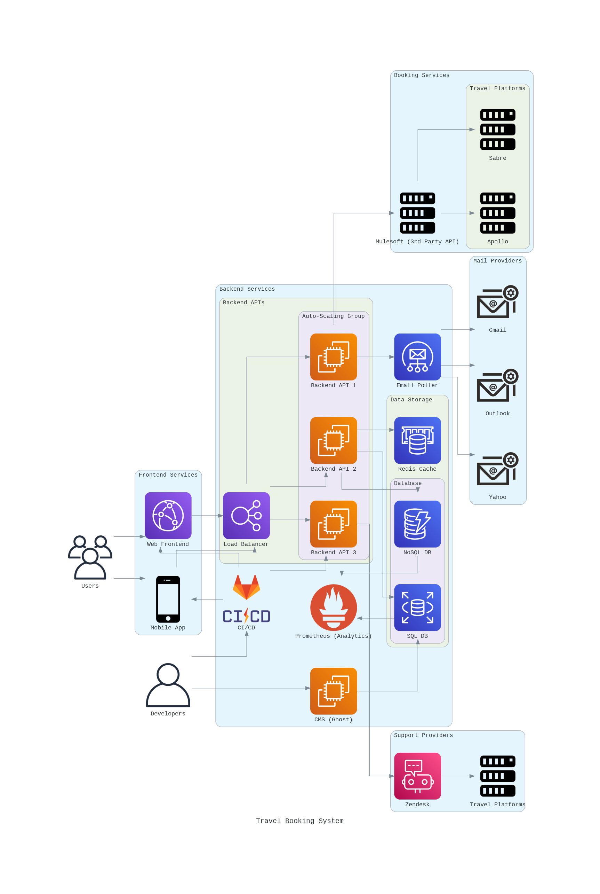
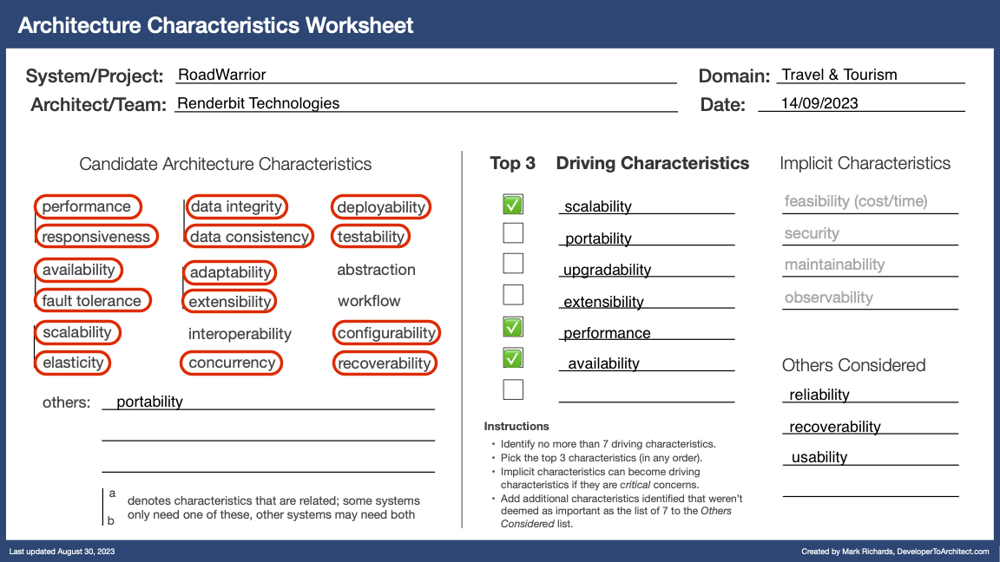
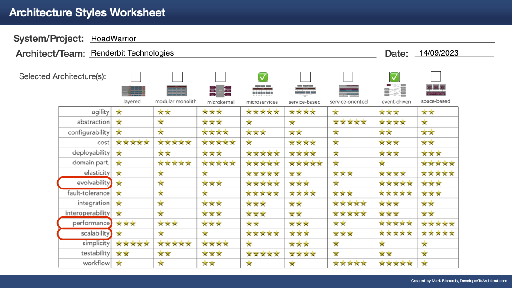
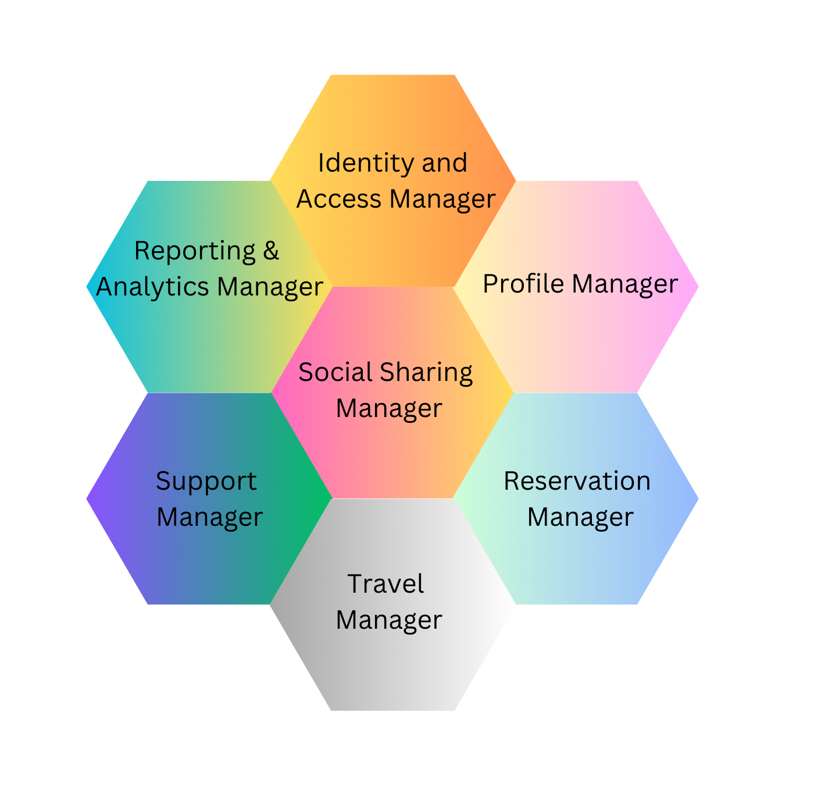
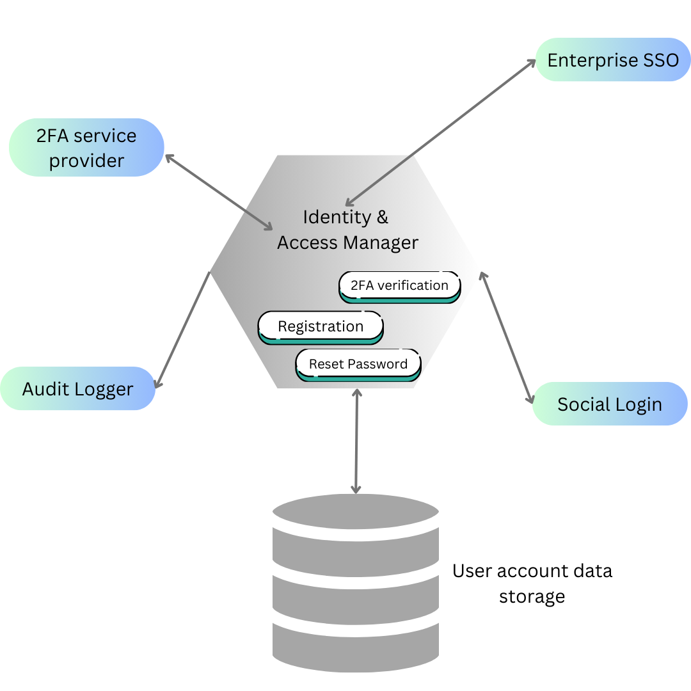
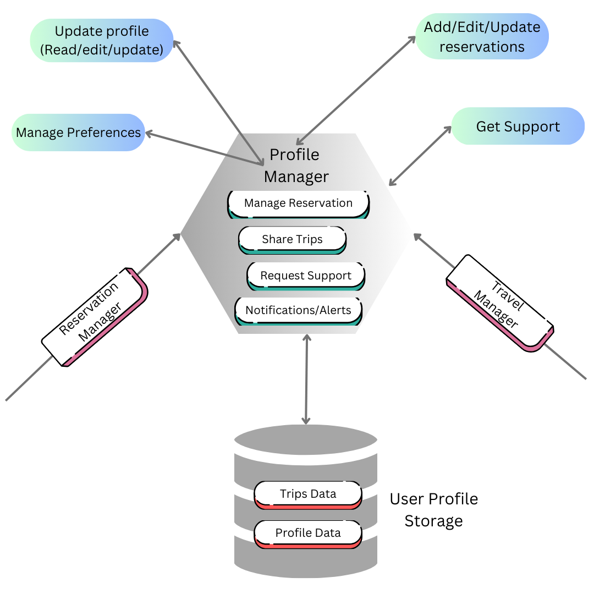
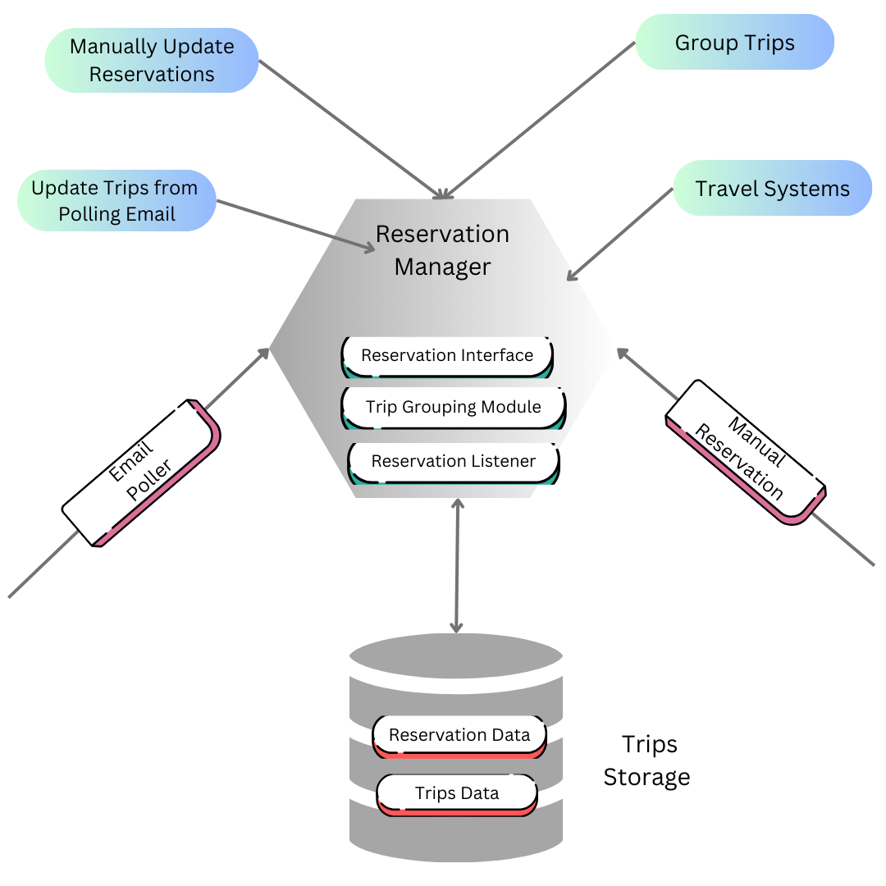
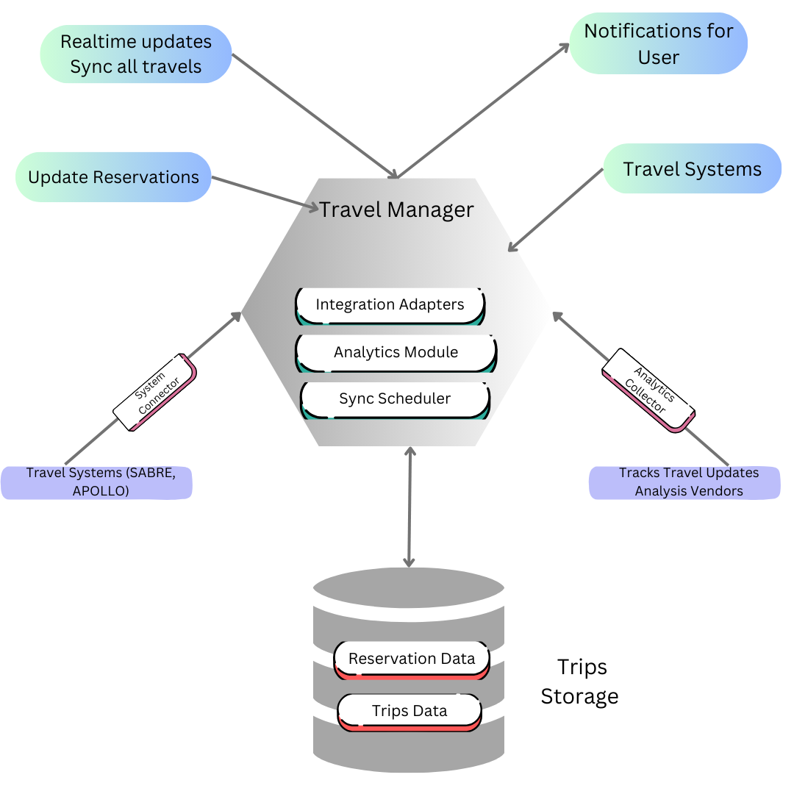
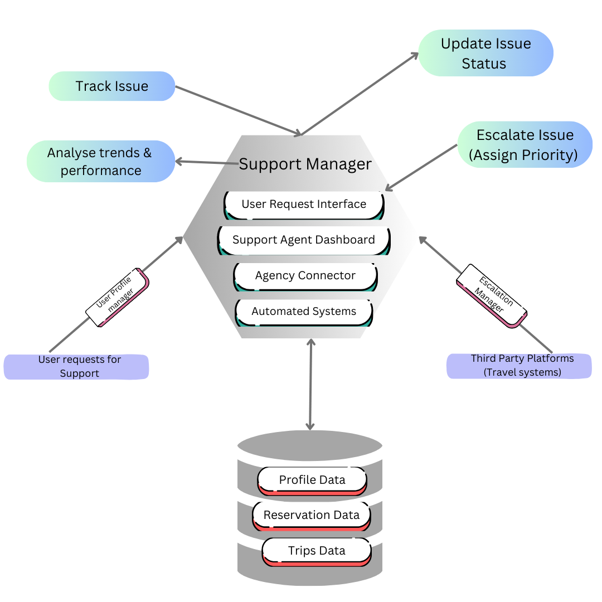
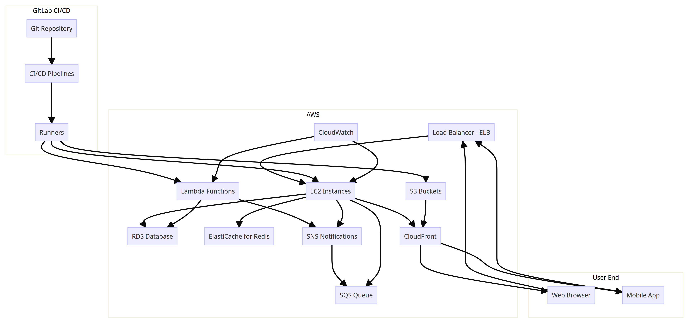

# RoadWarrior

## O'Reilly Architecture Katas - September 2023

This is a team submission for [O'Reilly Architecture Katas September 2023](https://learning.oreilly.com/featured/architectural-katas/).

### Team Name

Renderbit Technologies

### Team Members

| Name                  | LinkedIn                                                                                     |
| --------------------- | -------------------------------------------------------------------------------------------- |
| Soham Banerjee        | [https://linkedin.in/in/sohambanerjee-kolkata](https://linkedin.in/in/sohambanerjee-kolkata) |
| Shreya Pramanik       | [https://linkedin.in/in/pramanikshreya](https://linkedin.in/in/pramanikshreya)               |
| Aditya Vikram Jajodia | [https://www.linkedin.com/in/avjajodia/](https://www.linkedin.com/in/avjajodia/)             |github.com/carlosalbertomenezes) | [LinkedIn](https://www.linkedin.com/in/carloscardosomenezes/?lipi=urn%3Ali%3Apage%3Ad_flagship3_people_connections%3BFZxCll5DQouFM6zHFN48zg%3D%3D) |

## Contents

- [Introduction](#introduction)
- [Business Case](#business-case)
  - [Requirements](#requirements)
  - [Technical Constraints](#technical-constraints)
  - [Business Constraints](#business-constraints)
  - [Assumptions](#assumptions)
  - [High-Level Components](#high-level-components)
  - [Architectural Considerations](#architectural-considerations)
- [Architecture Characteristics](#architecture-characteristics)
  - [Driving Characteristics](#driving-characteristics)
  - [Implicit Characteristics](#implicit-characteristics)
  - [Others Considered](#others-considered)
- [Architecture Approach](#architecture-approach)
  - [Architecture Goals](#architecture-goals)
  - [Architecture Characteristics Evaluation](#architecture-characteristics-evaluation)
  - [Choice of Architecture](#choice-of-architecture)
- [Context](#context)
  - [Actors](#actors)
  - [Use Cases](#use-cases)
  - [Event Storming](#event-storming)
- [User Journeys](#user-journeys)
  - [Registration and Account Management](#registration-and-account-management)
  - [Email Polling and Travel Email Detection](#email-polling-and-travel-email-detection)
  - [Interfacing with Travel Systems for Updates](#interfacing-with-travel-systems-for-updates)
  - [Manual Reservation Management](#manual-reservation-management)
  - [Grouping and Archiving Reservations](#grouping-and-archiving-reservations)
  - [Social Media and Trip Sharing](#social-media-and-trip-sharing)
  - [Integration with Travel Agency for Support](#integration-with-travel-agency-for-support)
  - [Analytics and Reporting](#analytics-and-reporting)
- [Containers](#containers)
  - [Modular Monolith](#modular-monolith)
  - [Service Containers](#service-containers)
  - [API Layer](#api-layer)
- [Components](#components)
  - [Identity and Access Manager](#identity-and-access-manager-iam)
  - [Profile Manager](#profile-manager)
  - [Reservation Manager](#reservation-manager)
  - [Travel Manager](#travel-manager)
  - [Support Manager](#support-manager)
  - [Social Sharing Manager](#social-sharing-manager)
  - [Reporting and Analytics Manager](#reporting-and-analytics-manager)
- [Deployment](#deployment)
  - [Deployment Architecture Walkthrough](#deployment-architecture-walkthrough)
  - [AWS Services Used](#aws-services-used)
  - [Alternative Cloud Deployments](#alternative-cloud-deployments)
- [Cost Analysis](#cost-analysis)
  - [Service-wise Cost Breakdown](#service-wise-cost-breakdown)
  - [Total Estimated Monthly Cost](#total-estimated-monthly-cost)
  - [Cost Analysis Notes](#cost-analysis-notes)
- [Architecture Evaluation and Risks](#architecture-evaluation-and-risks)
  - [Adherence to Driving Characteristics](#adherence-to-driving-characteristics)
  - [Architectural Trade-Offs](#architectural-trade-offs)
  - [Architecture Fitness](#architecture-fitness)
  - [Conclusion](#conclusion)
- [References](#references)
  - [Architectural Decision Records](#architectural-decision-records)

@TODO: Reorder all diagrams

## Introduction

A new startup wants to build the next generation online trip management dashboard to allow travelers to see all of their existing reservations organized by trip either online (web) or through their mobile device.

## Business Case

### Requirements

The provided requirements document is available [here](./requirements-specification.md).

### Technical Constraints

1. **Integration with Legacy Systems**: The solution must integrate with the existing travel systems like SABRE and APOLLO, which may have proprietary interfaces or limitations in terms of data access and response times.

2. **Response Times**: The web interface must respond within 800ms, and the mobile interface must have a first contentful paint under 1.4 seconds.

3. **Real-time Updates**: Updates from travel agencies and other systems need to be presented within the application within 5 minutes of generation.

4. **Uptime**: The system must guarantee 99.9833% uptime, which translates to not more than 5 minutes of unplanned downtime per month.

5. **Cross-Platform Interface**: A consistent and rich user interface must be provided across all deployment platforms, which may restrict technology choices and require additional development and testing.

6. **International Availability**: The system must function across different geographical regions, accounting for potential regional restrictions and data sovereignty issues.

7. **Email Polling**: The solution must interface with varied email systems to poll and extract travel-related information.

8. **Data Analytics**: The system must be capable of gathering and processing large amounts of analytical data from user trips.

### Business Constraints

1. **Privacy Concerns**: Sharing trip information on social media or with specific individuals can lead to potential privacy concerns, thus requiring robust data protection and privacy measures.

2. **Data Validity**: The system relies on the validity of external data from airline, hotel, and car rental systems, as well as data parsed from emails, which may not always be accurate or up-to-date.

3. **User Adoption**: With 15 million accounts, ensuring smooth user adoption and minimal disruption during transitions or updates is crucial.

4. **Regulatory and Compliance Issues**: Operating internationally brings along various regulatory and compliance requirements related to data storage, user privacy, and more.

5. **Monetization**: The startup nature of the project implies a need to eventually find revenue streams, which may not be initially clear, especially when prioritizing user adoption and experience.

6. **Preferred Travel Agency Integration**: While the system integrates with a preferred travel agency for quick problem resolution, any limitations or delays from this agency directly impact the service quality.

7. **Competitive Advantage**: The requirement to have better real-time updates than competitors places an ongoing need for monitoring, benchmarking, and improving system performance.

### Assumptions

1. **Data Access**: Assumption that existing systems like SABRE and APOLLO will provide necessary access to data and interfaces required for real-time integration.

2. **User Behavior**: Assumption that users will be proactive in providing access to their emails for polling and will actively use the system for manual updates and trip management.

3. **Uniformity of Data**: Assumption that travel-related emails follow certain patterns or templates that can be reliably identified and parsed.

4. **Network Reliability**: Assumption that there will be consistent and reliable internet connectivity for real-time updates.

5. **Data Analytics Readiness**: Assumption that the data gathered will be readily usable for analytics, trend predictions, and reporting without significant data cleansing or transformation.

6. **Security Protocols**: Assumption that integrating with third-party systems (like travel agencies and social media platforms) will not pose significant security risks or vulnerabilities.

7. **User Base Growth**: Assuming a gradual growth in the active user base, which will allow the system to scale appropriately without sudden, unplannable spikes in demand.

### High-Level Components

- **Web Frontend:** A responsive web application built with modern frameworks like React or Angular.
- **Mobile App:** Native or cross-platform apps (like Flutter) to ensure optimal performance and UX.
- **Backend API:** RESTful/GraphQL APIs built with technologies such as Node.js or Spring Boot to serve both the web and mobile clients.
- **Database:** A distributed database system like Cassandra for scalability, combined with a relational DB like PostgreSQL for structured data.
- **Email Poller Service:** A separate service dedicated to pulling emails, filtering them, and feeding travel-related emails into the main system.
- **Travel Interface Connector:** To connect with systems like SABRE, APOLLO. This will regularly fetch and push updates.
- **Social Media Integrator:** For sharing trip details on social media platforms.
- **Data Analytics Service:** For processing, analyzing, and reporting user trip data.

A high-level component diagram of the system can be visualized below.

_Figure 1: High-Level Component Diagram_

### Architectural Considerations

- **Scalability and Cloud Platform:** Given the projected growth rate, we'll require a cloud platform that offers the ability to scale resources up and down with ease. AWS, Google Cloud, and Azure are all great options. Given the international nature of the app, we might choose AWS due to its more extensive global data center presence.
- **Latency and Data Centers:** We'd leverage AWS data centers in North America (US West and US East) and Western Europe (Frankfurt, London, or Paris) to reduce latency for primary markets. This might involve setting up multi-region deployments.
- **Content Delivery Network (CDN):** To further reduce latency and provide quick static content delivery to users worldwide, we'll use a CDN like Amazon CloudFront.

## Architecture Characteristics

The following section highlights the salient architecure characteristics we consider crucial to a successful implementation of the system.

### Driving Characteristics

| Characteristics   | Rationale                                                                                                             | Whether Top 3? |
| ----------------- | --------------------------------------------------------------------------------------------------------------------- | -------------- |
| **Scalability**   | With 15 million user accounts and 2 million active users/week, the system needs to handle high traffic and user data. | Yes            |
| Portability       | As an international system, it must operate across different regions and networks.                                    | No             |
| Upgradeability    | To remain competitive and relevant, the system should be able to incorporate new features or updates easily.          | No             |
| Extensibility     | Given integrations with various travel systems and potential future platforms, the architecture must be extensible.   | No            |
| **Performance**   | Fast response times are needed for both web and mobile, ensuring user satisfaction.                                   | Yes            |
| **Availability**  | With a max of 5 minutes of unplanned downtime per month, the system requires high availability.                       | Yes            |

### Implicit Characteristics

#### Security

We are transmitting and maintaining user's personal data such as their emails, phone numbers and locations over the web. The data needs to be secured in transit and at rest using appropriate encryption mechanisms. Also, there is need for data de-identification mechanisms and zero-trust verification policies when data needs to be accessed by the development team, admistrative users or other business stakeholders.

#### Usability

The system is meant to accessed via mobile apps primarily by non-technical users. The need for it to be intuitive and usable is implicit.

#### Cost

The system needs to be cost-effective as it needs to support millions of users with a high throughput and concurrent user load.

### Others Considered

#### Reliability

As the system is mission critical, and cost of downtime is high, it needs to be highly reliable to serve it's existing user base and onboard new ones without service interruptions.

#### Recoverability

In case of service downtime, the system needs to be able to recover in a consistent state.

The key architectural characteristics for the proposed system can be visualized below:

_Figure 2: Key Architectural Characteristics_

## Architecture Approach

1. **Decoupled Microservices Architecture**

   Given the requirement for scalability, especially with a potential of 2 million active users a week and the need to process real-time updates from various external systems, a microservices architecture offers decoupled services that can individually scale based on demand. For instance, the service handling email polling might be scaled differently from the service managing travel updates.

2. **Event-Driven Design**

   Considering the need for real-time updates and interactions between multiple components, adopting an event-driven design allows the system to react to changes and updates efficiently. It aids in ensuring updates are presented in the app within the desired 5-minute timeframe.

3. **Cloud-Native Deployment**

   To ensure high availability and meet the technical requirements of max 5 minutes unplanned downtime per month, a cloud-native deployment approach on platforms like AWS, Azure, or GCP would be pursued. These platforms provide the necessary tooling and infrastructure to ensure high availability, backups, and disaster recovery.

4. **Integration Gateways**

   Given the need to integrate with various external systems like SABRE, APOLLO, and social media platforms, dedicated integration gateways would be set up. These gateways would handle the specifics of communicating with each external system, offering a consistent interface to the internal components.

5. **Data Lakes for Analytics**

   Considering the analytical requirements and trend analysis, a data lake approach would be used to store raw data from various sources. This allows for efficient big data processing and ensures that analytical processes don't impact the operational efficiency of the system.

6. **Global Content Delivery & Data Localization**

   Given the international user base, a CDN (Content Delivery Network) approach would ensure that static content is delivered fast across the globe. Simultaneously, data localization strategies would be employed to ensure compliance with international data laws.

### Architecture Goals

1. **Scalability**: The architecture should support the platform's growth in terms of user numbers, data volume, and processing demands. It should effectively handle the demands of 2 million active users/week and beyond.

2. **Resilience & Availability**: With a technical requirement of max 5 minutes unplanned downtime per month, the system should be designed with redundancy, failovers, and quick recovery mechanisms.

3. **Integration Flexibility**: With many external systems to integrate with, the architecture should provide a flexible and maintainable approach to integrations. This ensures long-term viability even when external systems evolve or change.

4. **Data Security & Privacy**: Given the sensitive nature of travel data and the need to poll users' emails, the system should prioritize data security and user privacy, aligning with GDPR and other global data protection standards.

5. **Operational Efficiency**: To ensure updates within 5 minutes and web response times within 800ms, the system's operational efficiency is paramount. Efficient data pipelines, optimized databases, and streamlined processing are essential.

6. **Extensibility**: As user needs evolve and new features or integrations are required, the architecture should support easy extensibility without major overhauls. This includes the potential for future monetization strategies or new analytical insights.

7. **User Experience Focus**: With a requirement for a rich user interface across all platforms, the architecture should support seamless user experiences, fast load times, and intuitive interactions.

### Architecture Characteristics Evaluation

Figure 2 shows how our top 3 architecture characteristics score against formal system architecture styles.

_Figure 2: Architecture Styles_

### Choice of Architecture

A combination of microservices and event-driven architecture is ideal for the RoadWarrior platform, given its requirements for real-time responsiveness, scalability, and adaptability. Our system must quickly adapt to various real-time travel updates while ensuring seamless scalability for a rapidly growing user base. Microservices enable focused, independent scalability and evolution of distinct platform features, from email polling to travel updates. Coupled with an event-driven approach, this architecture ensures real-time, asynchronous communication across services, vital for timely user notifications and updates. In contrast, while patterns like modular monolith or service-based architectures offer modularity and clear boundaries, they may not provide the agility, scalability, or real-time responsiveness our platform demands. Service-oriented and space-based architectures, though efficient in their contexts, might introduce complexities not essential for our use-case. The fusion of microservices with event-driven principles, therefore, stands out as the most fitting choice for the dynamic, user-centric, and real-time nature of the RoadWarrior platform.

#### Impact for Top 3 Architectural Characteristics

1. **Scalability**
    - **Microservices**:
        - Pros: Microservices inherently support horizontal scalability. Each service can be scaled independently based on its individual load.
        - Cons: Requires proper service orchestration and might introduce complexities in inter-service communication.
    - **Event-driven**:
        - Pros: This style can handle a high volume of real-time data and scale out as needed, leveraging asynchronous communication and ensuring smooth system operations.
        - Cons: Requires robust event-handling mechanisms and a reliable messaging platform.

2. **Extensibility**
    - **Microservices**:
        - Pros: New functionalities can be added as new services without disrupting existing ones. This ensures the system remains adaptable and can grow with changing business requirements.
        - Cons: Service dependencies need careful management to avoid tight coupling.
    - **Event-driven**:
        - Pros: New events or event listeners can be added without altering existing flow. This provides a dynamic way to extend system behaviors.
        - Cons: Event schema evolution needs to be managed to avoid breaking changes.

3. **Performance**
    - **Microservices**:
        - Pros: Each service can be optimized for its specific task, and performance bottlenecks can be addressed at the individual service level.
        - Cons: Network latency might become a concern with excessive inter-service calls.
    - **Event-driven**:
        - Pros: Asynchronous nature ensures system responsiveness. Decoupled services ensure one component's failure doesn't slow down others.
        - Cons: Event processing time can be a factor, especially if event queues become overloaded.

#### Other Architectural Characteristics' Impact

- **Elasticity**:
  - Supported well by both architectures. Microservices can grow/shrink based on demand, and event-driven systems can handle fluctuating loads.

- **Fault Tolerance**:
  - Microservices ensure that a failure in one service doesn't bring down the entire system. Event-driven systems, with their decoupled nature, can handle failures gracefully by reprocessing events.

- **Interoperability**:
  - With clearly defined APIs and event schemas, both architectures support seamless integration with external systems.

- **Simplicity**:
  - While microservices introduce complexities in orchestration, they simplify system maintenance and evolution. Event-driven architectures simplify flow but require a robust event-handling mechanism.

- **Cost**:
  - Initial setup and orchestration might be costlier. However, in the long run, both architectures can lead to cost savings due to scalability and maintainability benefits.

- **Testability**:
  - Microservices can be tested in isolation. Event-driven systems require testing the event flow and ensuring events are processed correctly.

- **Deployability**:
  - Microservices allow for independent deployment and continuous delivery. Event-driven systems require coordination in event schema changes.

In conclusion, the combination of microservices and event-driven architecture provides a robust, scalable, and extensible solution, aligning well with the architectural goals of the RoadWarrior platform. While there are challenges, they are outweighed by the benefits, especially when considering the platform's long-term evolution and growth.

## Context

We start modelling the architecture of the system by envisioning the entire system as a black box. The Context model identifies all external actors and their interactions with the system.

### Actors and Use Cases

The users of the application fall into 2 categories. The public users will interact with the system using a mobile app, while the administrative and organisational use cases are more back end related, like data upload and ETL, reporting etc. Admin/Org users will interact with the system through a web based dashboard.

_Figure 2 Use Cases_

### Event Storming

The next step is zooming into the black box. The prerequisite to our goal of modelling the system as a set of independent microservices is to start with domain partitioning. To accomplish this we used the event storming process.
Event-storming begins with initially identifying "Domain Events". A Domain event is something that happens within the system. It is described by a ubiquitous language entity followed by a verb or action on that entity. Each use case in Figure 2 maps to one or more domain events shown here. As per the process, we identify as many domain events as we can and put each one on an orange sticky note on a virtual whiteboard.

_Figure 3 Domain Events_

Subsequently we identify the commands that trigger these domain events. While a domain event is something that happens within the system, the command is the action that triggers a series of domain events. Commands invoked by external actors are explicitly identified. Certain commands do not have an associated actor, which implies that it was invoked internally within the system. We organise the related sets of commands and domain events together into sets of related aggregates.

_Figure 4 Commands, Actors and Aggregates_

Next we determine the automation policies for the commands that do not have an associated external actor and are triggered when a certain domain event completes. The automation policies indicate asynchronous communication coupling between the bounded contexts. Grouping the semantically related aggregates together gives us the bounded contexts and the blueprint for individual microservices.

_Figure 5 Automation Policies and Bounded Contexts_

The above diagram gives us the boundaries of our bounded contexts and the event driven connections between them

## User Journeys

We have envisioned some of the common user journeys in the platform in the user journey diagrams below.

Please note that the user journeys listed here are not exhaustive, and are instead meant to be representative of a broad subset across the most commonly expected user journeys on the platform.

### Registration and Account Management

1. **Start**: The user initiates their journey into the Road Warrior platform.
2. **Open Road Warrior Dashboard**: The user accesses the main entry point of the application, the dashboard. Here they're presented with various options, including the ability to sign in or sign up.
3. **Choose Sign Up**: Instead of logging in, the user decides to create a new account. They select the "Sign Up" option.
4. **Enter Personal Details**: A registration form is presented, where the user is prompted to enter their personal details. This could include their name, email address, password, and perhaps other relevant information like contact number or address.
5. **Verify Email**: To ensure the authenticity of the provided email and to prevent fraudulent sign-ups, the user is sent a verification link or code to the email address they provided. They must access their email, retrieve the code or click the link, and enter or confirm it on the Road Warrior platform to verify their email address.
6. **Set Up Account Preferences**: Once verified, the user is redirected to an account setup page. Here they can customize their account preferences, like setting up their preferred travel modes, linking frequent flier numbers, or choosing notification settings.
7. **End**: Having successfully registered and set up their account preferences, the user's registration journey concludes. They are now a registered member of the Road Warrior platform and can start using its features fully.

### Email Polling and Travel Email Detection

1. **Start**: The journey commences as the user interacts with the Road Warrior platform.
2. **User Logs In**: The user signs into their Road Warrior account. This authentication allows the system to access the user's linked email for the polling process.
3. **System Polls Emails**: After successful login, the system automatically begins polling the user's linked email account, searching for new emails.
4. **Filter Travel-Related Emails**: The system filters the fetched emails, identifying those that are potentially travel-related based on specific keywords, patterns, or sender addresses.
5. **Whitelist Certain Emails**: From the identified travel-related emails, the system further filters the list by whitelisting certain trusted senders or email formats, ensuring the information extracted is accurate and reliable.
6. **Store Travel Details**: Once the relevant emails are selected, the system extracts travel details, such as reservation information, dates, flight numbers, etc., and stores them within the user's account for easy access and organization.
7. **End**: The email polling and travel detail extraction process concludes. The user can now view and manage their updated travel details on the Road Warrior dashboard.

### Interfacing with Travel Systems for Updates

1. **Start**: The process kicks off when the Road Warrior platform is actively monitoring for travel updates.
2. **System Detects Travel Change**: Through continuous monitoring, the system detects a potential change or update related to a user's travel plans. This could be through various means such as scanning notifications, API callbacks, or direct communications from integrated travel systems.
3. **Request Details from SABRE/APOLLO**: The system reaches out to the corresponding travel system (e.g., SABRE or APOLLO) to fetch detailed information regarding the detected change.
4. **Receive Real-Time Updates**: The Road Warrior platform gets real-time updates about the user's travel itinerary, such as flight delays, cancellations, hotel booking modifications, etc., from the travel systems.
5. **Update User's Reservation Details**: Based on the received information, the system promptly updates the user's reservation details in the dashboard to reflect the recent changes.
6. **Send Notification to User**: Once the updates are made, the platform immediately notifies the user about the changes through their preferred communication channel - this could be via the app, SMS, email, or push notifications.
7. **End**: The process of fetching and updating the user's travel information concludes, ensuring the user is always kept in the loop regarding any changes to their itinerary.

### Manual Reservation Management

1. **Start**: The process begins when a user wants to manually manage their reservations on the Road Warrior platform.
2. **User Logs In**: The user logs into the Road Warrior dashboard to access their personal travel details.
3. **Open Reservations Section**: After logging in, the user navigates to the reservations section of the dashboard where they can view and manage all their travel reservations.
4. **Choose Add/Update/Delete**: In the reservations section, the user has the option to either add a new reservation, update an existing one, or delete a reservation.
5. **Enter Reservation Details**: Depending on the chosen action (Add/Update), the user is prompted to enter or modify the relevant reservation details, such as flight information, hotel bookings, car rentals, etc.
6. **Save Changes**: Once the necessary details are entered or modified, the user confirms and saves the changes to their reservations.
7. **End**: With the changes saved, the user's manual reservation management process concludes, ensuring their travel plans are accurately reflected on the dashboard.

### Grouping and Archiving Reservations

1. **Start**: The user decides to organize their reservations on the Road Warrior platform.
2. **User Logs In**: To initiate the process, the user logs into their Road Warrior dashboard.
3. **View All Reservations**: After logging in, the user can see a list or grid of all their reservations.
4. **Group Reservations by Trip**: From the displayed reservations, the user has the ability to group multiple reservations together based on a specific trip. This can include grouping flights, hotels, and car rentals for a single trip.
5. **Trip Completed?**: The system checks or prompts the user to verify if the grouped trip has been completed.
6. **Archive Reservations**: If the trip is marked as completed, those reservations associated with the trip are automatically moved to an archive or "past trips" section, decluttering the main dashboard view.
7. **End**: With the reservations appropriately grouped and archived, the user's interaction in this journey concludes.

### Social Media and Trip Sharing

1. **Start**: The user initiates the process to share their trip details on the Road Warrior platform.
2. **User Logs In**: The user securely logs into their Road Warrior dashboard.
3. **Select Trip Details**: After successful login, the user navigates to their reservations or trip details they wish to share.
4. **Choose Share Option**: A 'share' or 'broadcast' option is available for the user to initiate the sharing process.
5. **Select Social Media/Specific People**: The user is presented with options to share their trip details on popular social media platforms or directly with specific people through email or messaging.
6. **Confirm Sharing**: Before the details are shared, a confirmation prompt is displayed ensuring that the user is aware of the data they are sharing and to whom it's being shared.
7. **End**: Upon confirmation, the trip details are shared, and the user's interaction in this journey concludes.

### Integration with Travel Agency for Support

1. **Start**: The journey begins when the user faces any travel-related issue or requires assistance on the Road Warrior platform.
2. **User Faces Issue**: While using the platform or during their travel, the user encounters a problem or has a query.
3. **Contact Preferred Travel Agency**: The user utilizes the in-app feature to reach out to their preferred travel agency, integrated with the Road Warrior system, for direct and immediate support.
4. **Agency Provides Support**: The integrated travel agency receives the user's request and provides necessary assistance, be it changes in reservations, clarifications, or other support.
5. **Issue Resolved**: The travel agency successfully addresses the user's issue, and the user is satisfied with the resolution provided.
6. **End**: The user continues to use the platform, and their interaction for this specific support journey concludes.

### Analytics and Reporting

1. **Start**: The user journey begins when the user decides to analyze their travel patterns or requires a summary of their travel data.
2. **User Requests End-of-Year Report**: On the Road Warrior platform, the user initiates a request for an end-of-year summary, which encompasses details of all their travels, reservations, expenses, and more.
3. **System Gathers User's Travel Data**: In response to the request, the system initiates a process to collect all pertinent travel data associated with the user's account for the specified year.
4. **Generate Comprehensive Report**: Once all data is collected, the system processes and compiles this information to create a detailed and comprehensive report. This report contains metrics, travel patterns, and insights tailored for the user.
5. **Display Report to User**: The generated report is presented to the user through the platform's interface, allowing them to view, analyze, and even download for their records.
6. **End**: Having accessed and reviewed the report, the user's journey in the analytics and reporting segment concludes.

## Containers

### Modular Monolith

The event storming process described in the previous section allowed us to identify the bounded contexts of our system and the aggregates (components) within them. We now map each bounded context to be a module of our overall system. The resulting modular monolith is depicted in the following diagram.

_Figure 6 Modular Monolith_

### Service Containers

The previous section described a single container, comprising of multiple modules. It did not give us any information about how the modules are coupled. The next step therefore is to segregate the container along the boundaries of our bounded contexts. The following diagram illustrates the the interactions between the various microservices and the external actors.

**Note**
Synchronous communication coupling between the services is omitted from this diagram for clarity, but it is shown in figure 9 and discussed in the related section

_Figure 7 Service Containers_

### API Layer

Next, we add an API layer to extract the publically accessible interface of the system. Instead of external users directly connecting to the individual services via a GUI, all external requests will be routed through the API layer. Also see [ADR04-API-layer](/ADRs/ADR04-API-Layer.md)

_Figure 8 API Layer_

**Note**
In the above diagram, the API layer only serves requests from public mobile-app based clients. This is on purpose, the administrative/organizational users will make up a small fraction of the total user base of the system. Their use cases are also different from reqular users, thus it makes sense for them to have separate APIs for accessing relevant services. Identity, access control and authentication mechanisms for administrative users are also significantly different from those of public users who do not have access to internal infrastructure, data and services.

### Coupling and Architecture Quanta

Finally we close out the service containers section with a discussing of coupling between the services and architecure quanta.

The previous diagram showed 8 distinct containers including the API layer.
Since the API layer is simply a proxy, it does not include any domain specific functionality or perform any workflow orchestration, we can omit it from this section.

The following diagram illustrates how the remaining services are coupled, that databases they own or share, and the domain entities in those databases.

_Figure 9 Coupling and Quanta_

#### Static Coupling

- The ETL service and the Rewards Manager microservice are statically coupled through a shared database. We could make a case for separating transactions from master data into two separate databases, where ETL only writes to the master database and Rewards manager only reads from it as shown in the diagram. This however does not do much to reduce the contract coupling introduced by shared data they have to work with. The diagram shows to separate databases for clarity and semantic reasons

#### Dynamic Coupling

- The Profile service synchronously requests data from IAM service
- The Rewards and Connections services synchronously requests data from the Profile service
- The Profile service asynchronously ingests messages/events from Rewards and Connections services
- The Reporting and analytics service asynchronously ingests messages/events from the Profile service

The Social Media API does not depend upon any other services, it is invoked directly from admin dashboards. It is in a sort of middle ground, where it’s trivial enough not warrant it’s own Microservice, but semantically it does not make sense to make it part of other services we have defined.

Given the shared database between the ETL and Rewards service, the system architecure has a quanta of 6, illustrated by the dashed lines in the above diagram.

## Components

The following section describes the internal components of each microservice identified the previous section:

1. **Identity and Access Manager:** Handling user registration, login, and access management.
2. **Profile Manager:** Managing the user's profile and preferences.
3. **Reservation Manager:** Handling reservations, including manual entries and those from emails.
4. **Travel Manager:** Interfacing with SABRE, APOLLO, and other systems to get live updates.
5. **Support Manager:** Facilitating user requests for support from the travel agency.
6. **Social Sharing Manager:** Handling sharing of trip details to social media.
7. **Reporting and Analytics Manager:** Generating end-of-year reports and analytical data.

The components can be visualized in a hexagonal microservices-oriented architecture pattern in the diagram below:

_Figure 5: Component Diagram_

The internal components or "ports" within a microservice expose one or more interfaces or "adapters" that serve the needs of downstream consumers. For example, some component within a microservice may expose it's functionality over a REST, SOAP or RPC based interface. We may maintain multiple adapters for a single port at the same time or swap out the port if the need arises without the adapter having to change. Interface definition is thus pushed out to be an extrinsic configuration concern.

We will attempt to keep our architectural description tool and framework agnostic. As mentioned before we want to avoid early lock in with specfic tools. To that end, all intra, inter, and extra service communication APIs will be described in language agnostic terms.

The architecture we describe here is not meant to be prescriptive. The system could even be developed and deployed as a modular monolith, combining all bounded contexts in a single container, which could then be scaled by deploying multiple instances of it. This is a viable approach that can be taken initially for rapidly prototyping a minimum viable product at a reduced overall cost of development.

### Identity and Access Manager (IAM)

The Identity and Access Manager is a critical component of the RoadWarrior platform. It manages user identities and their respective permissions to ensure that only authorized individuals can access specific functionalities within the application. Given the user base and requirements, the IAM is expected to handle a high volume of authentication and authorization requests efficiently.

#### IAM Sub-Components and Functionalities

1. **User Registration and Authentication:**

   - **User Database:** Stores user credentials (hashed passwords, salt) and other essential user identification information.
   - **Authentication API:** Provides endpoints for user registration, login, and logout. It'll handle username/password-based authentication, possibly integrating with OAuth or OIDC providers for social logins.
   - **Token Service:** Generates and validates tokens (like JWT) after successful authentication, ensuring secure and stateless sessions.

2. **Authorization:**

   - **Role Database:** Defines roles such as "Registered User," "Premium User," or "Admin." Each role has specific permissions associated with it.
   - **Authorization Middleware:** Intercepts incoming requests, verifies the provided token, and checks the user's role against required permissions.

3. **Password Management:**

   - **Password Reset Module:** Provides endpoints for users to reset forgotten passwords, typically involving email verification.
   - **Password Policy Enforcer:** Ensures that users' passwords comply with security standards, such as minimum length, requiring special characters, and so on.

4. **Multi-Factor Authentication (MFA):**

   - **MFA Module:** Enhances security by requiring users to provide multiple forms of identification before accessing their accounts. Typically involves SMS verification or authenticator apps.
   - **MFA Database:** Stores data related to MFA like backup codes, registered devices, etc.

5. **Session Management:**

   - **Session Handler:** Provides functionalities like checking active sessions, logging out from all devices, or renewing session tokens.
   - **Session Database:** Stores active sessions, associated tokens, and expiration timestamps.

6. **Access Logs and Audit:**

   - **Audit Logger:** Logs all authentication and authorization attempts, both successful and unsuccessful, for security analysis and compliance.
   - **Log Database:** A dedicated storage for logs, ensuring they're tamper-proof and retained for an appropriate duration as per compliance needs.

7. **Rate Limiting and Security:**

   - **Rate Limiter:** Limits the number of login attempts from a single IP or for a specific user to prevent brute force attacks.
   - **Security Module:** Monitors for suspicious activities, like rapid succession login attempts, logins from new locations, and can temporarily lock accounts or require additional verification.

8. **Integration Adapters:**
   - **Social Login Adapters:** Provides seamless integration with external identity providers like Google, Facebook, etc., for quick registrations and logins.
   - **Enterprise Single Sign-On (SSO):** For users associated with business accounts, provides SSO capabilities to integrate with enterprise authentication systems.

Given the vast user base and the need to provide real-time updates, this IAM must be highly available, scalable, and should work seamlessly with other components like the Profile Manager and Email Polling Manager. It's essential to keep the IAM system's latency low to ensure quick login and access times, meeting the performance requirements specified earlier.

_Figure 10: Identity and Access Manager_

### Profile Manager

The Profile Manager component is pivotal for personalizing user experiences in the RoadWarrior platform. It retains and manages user profiles, preferences, past trips, and other personalized data. The system ensures that users have a consistent experience whether they're accessing RoadWarrior through the web or mobile devices.

#### Profile Manager Sub-Components and Functionalities

1. **User Profile Storage:**

   - Profile Database: A dedicated storage system that keeps user-related data such as name, email, contact details, profile picture, and other metadata.
   - History Database: Archives of past trips, reservations, and activities carried out by the user on the platform.

2. **Profile CRUD API:**

   - CRUD Endpoints: Provides the necessary interfaces for creating, reading, updating, and deleting user profile details.
   - Profile Validator: Ensures data consistency and validation, such as verifying phone numbers or standardizing address formats.

3. **Preference Management:**

   - Preference Handler: Manages user-specific settings like language preferences, notification settings, and theme choices.
   - Preference Database: A storage system that archives user-specific preferences.

4. **Trip History and Archiver:**

   - History Logger: Tracks and logs user activity related to travel, such as bookings, cancellations, and updates.
   - Archiver: Periodically moves completed trip details from the main profile view to a historical view for cleaner user experience.

5. **Integrations with Other Managers:**

   - IAM Integration: Ensures that any request to modify profile data is from authenticated and authorized users.
   - Booking Data Integrator: Gathers data from the Third-Party Travel APIs Manager and the Email Polling Manager to continuously update the user's trip details.

6. **User Feedback and Support:**

   - Feedback Handler: Allows users to provide feedback on their experiences, suggesting improvements or reporting issues.
   - Support Request Integrator: Integrates with Booking Support Manager to resolve any profile-related concerns or queries.

7. **Notifications and Alerts:**

   - Notification Engine: Manages and sends real-time notifications to users based on their preferences.
   - Alert Database: Tracks and archives past alerts and notifications sent to the user.

8. **Security and Data Privacy:**
   - Data Encryption Module: Ensures that sensitive user profile data is encrypted both in transit and at rest.
   - Data Retention Policies: Regularly audits and deletes data that's no longer necessary, adhering to data privacy standards and regulations.

With millions of active users, the Profile Manager must ensure data integrity, quick access times, and high availability. Integration with other components ensures a seamless user experience, be it updating profile details, reviewing past trips, or setting platform preferences. The design must uphold the principles of user data privacy and ensure timely synchronization with other system components.

_Figure 11: Profile Manager_

### Reservation Manager

The Reservation Manager is central to the RoadWarrior platform as it manages all reservations for the user, whether manually entered or sourced from email polling.

#### Reservation Manager Sub-Components and Functionalities

1. **Email Poller Sub-Component**

   - Poller Scheduler: Initiates regular checks for new travel-related emails.
   - Email Filter Engine: Scans emails, discarding irrelevant ones and forwarding travel-related emails to the Processor.
   - Email Processor: Extracts relevant reservation details from emails and converts them to a standardized format for storage.

2. **Manual Entry Interface**

   - Form UI: Presents the user with an interface to manually input reservation details.
   - Input Validator: Checks user inputs for accuracy and completeness.
   - Data Sanitizer: Ensures the manually entered data is free from potential security threats.

3. **Reservation Database Interface**

   - Data Mapper: Converts raw reservation data into a format suitable for database storage.
   - CRUD Operations Module: Handles Create, Read, Update, and Delete operations for the reservations in the database.
   - Cache Manager: Temporarily stores frequently accessed reservations for faster retrieval.

4. **Trip Grouping Logic**

   - Trip Identifier: Determines which reservations belong to a specific trip based on dates, destinations, and other related data.
   - Grouping Module: Organizes reservations under the identified trips for a more cohesive view.
   - Trip Completion Detector: Monitors the trip dates and marks the trip as complete post the return date.

5. **Reservation Update Listener**

   - Event Listener: Watches for real-time updates relevant to a user's reservations.
   - Update Processor: Upon receiving an update, processes and reflects it in the user's reservations.
   - Notification Dispatcher: Informs the user about critical updates, e.g., cancellations or gate changes.

6. **Data Export/Import Module**

   - Data Serializer: Converts reservation data into formats suitable for exporting, such as JSON or XML.
   - Data Deserializer: Converts imported data into a format suitable for processing and storage.

7. **Security & Compliance Layer**

   - Data Encryption: Ensures that sensitive reservation details are encrypted at rest and in transit.
   - Regulation Compliance Checker: Ensures any stored or processed reservation adheres to travel and data protection regulations.

8. **Integration Adapters**
   - Email Service Adapter: Facilitates communication between the Reservation Manager and the email service being used.
   - External Reservation Systems Adapter: Facilitates integration with other reservation systems if needed in the future.

The Reservation Manager provides a comprehensive approach to efficiently handle and present reservations to users while ensuring high reliability, accuracy, and timeliness.

_Figure 12: Reservation Manager_

### Travel Manager

The Travel Manager is responsible for ensuring that all travel-related details are up-to-date by interfacing with external travel systems like SABRE, APOLLO, and others. This component ensures that users are kept informed about any changes to their travel plans in real time.

#### Travel Manager Sub-Components and Functionalities

1. **External System Interface**

   - System Connector: Establishes and maintains connections with external travel systems, such as SABRE and APOLLO.
   - Data Fetcher: Periodically retrieves data or listens for real-time updates from these systems.
   - Data Mapper: Converts data from the external systems into a format suitable for internal processing and storage.

2. **Update Processor**

   - Change Detector: Compares the fetched data with stored reservation details to identify any changes or updates.
   - Data Updater: Modifies the existing reservations in the system database with the detected changes.
   - Conflict Resolver: Handles any discrepancies between stored reservation details and the updates received, flagging manual checks if necessary.

3. **Notification Dispatcher**

   - User Notifier: Informs the user about critical updates like delays, cancellations, gate changes, etc.
   - Channel Selector: Chooses the most appropriate channel (app notification, email, SMS) based on user preferences and urgency of the update.

4. **System Synchronization Logic**

   - Sync Scheduler: Sets regular intervals for checking updates to keep the data as current as possible.
   - Real-time Listener: An event-driven approach where the manager listens for real-time updates instead of polling at regular intervals.
   - Fault Tolerance Mechanism: Ensures the synchronization process continues smoothly even if there are temporary outages or interruptions with the external systems.

5. **Security & Compliance Layer**

   - Data Encryption: Ensures that sensitive travel update details are encrypted at rest and in transit.
   - API Security Measures: Implements standards like OAuth for authenticating and authorizing communication with external systems.

6. **Integration Adapters**

   - Protocol Adapters: Converts data formats and communication protocols to be compatible with various external systems.
   - Error Handler: Manages any errors or exceptions raised during integration, logging them for further analysis.

7. **Analytics & Metrics Collector**
   - Update Frequency Analyzer: Tracks how often travel details are updated for analytical purposes.
   - Vendor Preference Detector: Analyzes updates to determine preferences in airlines, hotels, or car rentals.

The Travel Manager ensures that users receive timely and accurate information about their reservations, fostering trust in the platform's capability to keep them informed.

_Figure 15: Travel Manager_

### Support Manager

The Support Manager acts as the main interface between users facing issues or seeking assistance with their travel plans and the preferred travel agency. The component ensures swift problem resolution, providing users with a seamless travel experience.

#### Support Manager Sub-Components and Functionalities

1. **User Request Interface**

   - Ticket Creation: Allows users to raise specific issues or support requests, specifying details of their problem.
   - Ticket Tracker: Provides users with real-time status updates on their raised tickets or support requests.
   - Support Chat: Facilitates direct interaction with support representatives through a chat interface.

2. **Support Agent Dashboard**

   - Ticket Queue: Displays all the incoming support requests, prioritized based on urgency or user preferences.
   - User History Viewer: Allows agents to view user profiles and past support interactions for context.
   - Resolution Assistant: Suggests potential solutions to agents based on common or previously resolved issues.

3. **Integration with Travel Agency Systems**

   - Agency Connector: Interfaces with systems of the preferred travel agency for support delegation and updates.
   - Issue Forwarder: Directly forwards complex issues to the travel agency when required.
   - Feedback Loop: Collects resolution details and feedback from the travel agency to inform the user.

4. **Automated Issue Resolver**

   - Common Issues Database: Stores resolutions to frequently encountered problems for quick solutions.
   - Problem Matcher: Analyzes the user's issue and matches it with potential resolutions from the database.
   - Self-help Assistant: Guides users through self-resolution steps for common and non-critical issues.

5. **Escalation Mechanism**

   - Priority Assessor: Determines the severity of issues based on user input and system data.
   - Escalation Trigger: Forwards high-priority or unresolved issues to higher support tiers or agency specialists.
   - Notification Dispatcher: Alerts support team leads or management of escalated cases.

6. **Feedback & Review System**

   - Resolution Feedback Collector: Gathers user feedback post-resolution to assess satisfaction.
   - Support Rating Mechanism: Allows users to rate their support experience, helping in continuous improvement.

7. **Reporting & Analytics**
   - Issue Trend Analyzer: Examines recurring issues to recommend system improvements.
   - Agent Performance Metrics: Tracks metrics like resolution time and user satisfaction to evaluate support team performance.

The Support Manager ensures that users receive prompt and effective assistance, reinforcing their confidence in the platform's dedication to user satisfaction.

_Figure 16: Support Manager_

### Social Sharing Manager

The Social Sharing Manager aims to make the sharing of travel plans and updates a smooth, user-friendly experience. It provides interfaces for sharing travel details through standard social media platforms and allows users to share specific trip information with a select group of people through invitation-based access.

#### Social Sharing Manager Sub-Components and Functionalities

1. **Social Media Integration Module:**

   - Social Media Connector: Allows users to connect their social media accounts (Facebook, Twitter, Instagram, etc.) to the platform.
   - Social Media Publisher: Facilitates the publishing of trip information to connected social media accounts.

2. **Privacy & Permissions Engine:**

   - Access Control: Allows users to set privacy settings for shared information.
   - Invitation Manager: Handles the sending and revoking of sharing invitations to specific contacts via email or a generated link.

3. **Trip Bundler:**

   - Trip Selector: Allows users to choose which trips or parts of trips they want to share.
   - Content Formatter: Takes selected trips and formats the information for sharing, such as creating a summary or an itinerary.

4. **In-app Sharing Mechanism:**

   - Peer Sharing: Enables users to share trip information with other RoadWarrior users directly within the app.
   - Group Sharing: Allows sharing with multiple people, like family or friends, by creating a shareable group.

5. **Push Notifications & Alerts:**

   - Event Listener: Listens for updates or changes to the shared trip and triggers notifications.
   - Notification Dispatcher: Sends out notifications to all the sharing parties when updates occur (e.g., change in flight status, hotel booking, etc.).

6. **Analytics & Monitoring:**

   - Share Metrics Tracker: Collects data on how often trips are shared, through which platforms, and what elements of the trip are most shared.
   - Engagement Analyzer: Measures the engagement level of shared content, like the number of views or interactions it receives.

7. **Dynamic Link Generator:**

   - URL Shortener: Creates short, user-friendly URLs for sharing trip details.
   - QR Code Generator: Enables users to generate QR codes that link to their shared trips for easy scanning and access.

8. **Customization & Templates:**

   - Template Builder: Offers a range of customizable templates for how the shared information will appear.
   - Theme Selector: Allows users to choose themes or designs to apply to the shared content, enhancing visual appeal.

9. **Security Measures:**

   - Encryption: Ensures that shared data is encrypted during transmission.
   - Token-based Authentication: Ensures only authorized users can access shared trip information.

10. **Help & Support:**
    - FAQ & Guidelines: Provides a set of frequently asked questions and guidelines on how to use the sharing features effectively.
    - Customer Support: Offers in-app support for users facing issues or having questions about the sharing functionality.

The Social Sharing Manager makes sharing travel plans a seamless, user-centric experience while also ensuring that the shared information is secure and respects user privacy.

_Figure 18: Social Sharing Manager_

### Reporting and Analytics Manager

The Reporting & Analytics Manager plays an instrumental role in understanding user behavior, travel trends, and platform performance. It furnishes users with end-of-year summary reports and extracts insightful analytics for business strategy and platform enhancements. By capturing, processing, and visualizing vast amounts of data, this manager aids in decision-making and offers a more tailored user experience.

#### Reporting and Analytics Manager Sub-Components and Functionalities

1. **Data Collection Module:**
   - User Behavior Tracker: Monitors and logs user interactions within the app for analysis.
   - External Data Collector: Gathers data from Third-Party Travel APIs Manager, Email Polling Manager, and other components.

2. **Data Processing & Transformation Engine:**
   - Data Cleansing Tool: Removes anomalies, duplicates, or irrelevant data points.
   - Data Mapper: Transforms raw data into structured formats suitable for analysis.

3. **Analytics Engine:**
   - Descriptive Analytics: Provides insights on historical data, showing travel patterns, popular destinations, etc.
   - Predictive Analytics: Uses statistical models to forecast future travel trends and user preferences.
   - Prescriptive Analytics: Offers recommendations based on historical and forecasted data, such as suggesting promotional strategies.

4. **Reporting Module:**
   - Dynamic Report Generator: Creates customizable reports based on user-defined parameters.
   - End-of-Year Summary Builder: Compiles yearly travel summaries for individual users, highlighting key metrics.

5. **Visual Data Representation Tools:**
   - Dashboard Builder: Allows admins or business analysts to build dynamic visual dashboards.
   - Data Visualization Library: Offers various visualization tools like bar charts, heat maps, and geographical plotting.

6. **Trend Analysis & Detection:**
   - Anomaly Detector: Spots and notifies of any unusual patterns, which could indicate issues or emerging trends.
   - Seasonality Tracker: Identifies recurring seasonal patterns in travel behaviors.

7. **Feedback Analysis System:**
   - Sentiment Analyzer: Processes user feedback to gauge sentiment and satisfaction levels.
   - Feedback Categorizer: Segregates feedback into predefined categories for structured analysis.

8. **Integration & Interoperability Layer:**
   - Data Sync Tool: Ensures the latest data is available from other components of the platform.
   - API Communicator: Retrieves and sends data to other components when needed.

9. **Security & Compliance Mechanism:**
   - Data Encryption: Encrypts sensitive analytics data, ensuring it's secure at rest and in transit.
   - Privacy Guard: Ensures that user data used for analytics is anonymized or pseudonymized, adhering to privacy regulations.

10. **Storage & Database Management:**
    - Data Warehouse: Stores large volumes of historical data in an optimized manner for analysis.
    - Database Optimizer: Enhances retrieval times for commonly accessed datasets or queries.

The Reporting & Analytics Manager not only enriches the RoadWarrior platform's business insights but also amplifies user engagement by providing them with valuable summaries and potentially offering tailored travel suggestions in the future.

_Figure 17: Reporting and Analytics Manager_

## Deployment

The next diagram models a sample deployment of the system on the Amazon Web Services (AWS) Platform. A brief overview of the involved AWS services follows, along with other major cloud alternatives.

_Figure 19: AWS Deployment Architecture_

### Deployment Architecture Walkthrough

1. **User End:** Represents user devices - browsers and mobile applications.
2. **GitLab CI/CD:**
   - **Git Repository:** Contains the source code of the application.
   - **CI/CD Pipelines:** Manages the CI/CD operations, like build, test, and deploy.
   - **Runners:** Executes the CI/CD tasks and deploys them on AWS.
3. **AWS:**
   - **Load Balancer (ELB):** Distributes incoming traffic across EC2 instances.
   - **EC2 Instances:** The main servers where the Road Warrior platform runs.
   - **Lambda Functions:** Serverless functions for smaller tasks like notifications.
   - **RDS Database:** Database service to store user data and reservations.
   - **ElastiCache for Redis:** Cache service for better performance.
   - **S3 Buckets:** Stores assets like images, static files, and deployment artifacts.
   - **SNS Notifications:** Publishes messages to subscribed endpoints or clients.
   - **SQS Queue:** Buffers messages sent between services.
   - **CloudWatch:** Monitors and logs for AWS services.
   - **CloudFront:** Content Delivery Network (CDN) for serving content faster.

In the deployment process:

- Developers push code to the Git repository.
- GitLab CI/CD pipelines are triggered, which utilize runners.
- The runners test, build, and deploy the code onto AWS services, like EC2 instances and Lambda functions.
- AWS infrastructure serves the application, with the ELB distributing incoming traffic, EC2 instances processing the requests, and other services like RDS, S3, and ElastiCache supporting the backend.

### AWS Services Used

#### Networking

- Use AWS VPC to create a private network
- Set up private and public subnets
- Use NAT Gateways to allow outbound internet access for private subnets
- Implement VPC Peering if there's a need for communication between VPCs

#### Compute

- Deploy microservices on Amazon ECS (Elastic Container Service) using Docker. This provides auto-scaling, load balancing, and service discovery out-of-the-box
- For the Email Polling Monolith, use EC2 instances with Auto Scaling Groups for failover and redundancy

#### Storage

- Use Amazon RDS for relational databases
- Deploy Amazon S3 for storing user attachments and backups
- Use EBS for block-level storage needs of EC2 instances

#### Security & Authorization

- Implement IAM roles and policies for granular access control
- Use AWS Secrets Manager for sensitive data and secrets
- Enable AWS Shield for DDoS protection
- Use AWS WAF for web application firewall needs

#### Continuous Integration and Deployment

- Set up a CI/CD pipeline using AWS CodePipeline and AWS CodeBuild
- Integrate with GitLab for source code management and triggers
- Use AWS CodeDeploy to handle deployments, ensuring zero downtime

#### Monitoring & Logging

- Implement AWS CloudWatch for monitoring
- Use Amazon CloudTrail for auditing AWS resource actions
- Enable AWS X-Ray for tracing requests and responses

#### Backup & Recovery

- Regular RDS backups
- Use Amazon S3's versioning feature for object-level recovery

### Alternative Cloud Deployments

#### Azure Equivalent Deployment

1. **Account Setup:** Use Azure Subscriptions and Management Groups
2. **Networking:** Deploy Azure Virtual Network with subnets
3. **Compute:** Use Azure Kubernetes Service (AKS) for microservices and Azure VMs for monolithiccomponents.
4. **Storage:** Use Azure SQL Database and Azure Blob Storage
5. **Security:** Leverage Azure Active Directory and Key Vault
6. **CI/CD:** Implement Azure DevOps for CI/CD
7. **Monitoring & Logging:** Utilize Azure Monitor and Application Insights
8. **Backup & Recovery:** Use Azure Backup services

#### Google Cloud Platform (GCP) Equivalent Deployment

1. **Account Setup:** Use GCP Organizations and Projects
2. **Networking:** Set up Google Cloud VPC with subnets
3. **Compute:** Deploy on Google Kubernetes Engine (GKE) for microservices and Compute Engine for monolithic components
4. **Storage:** Use Cloud SQL and Google Cloud Storage
5. **Security:** Implement Identity & Access Management (IAM) and use Secret Manager
6. **CI/CD:** Utilize Cloud Build and integrate with GitLab
7. **Monitoring & Logging:** Deploy Google Cloud Operations Suite (formerly Stackdriver)
8. **Backup & Recovery:** Use Persistent Disk Snapshots for backups

## Cost Analysis

### Service-wise Cost Breakdown

#### Compute (EC2 & ECS)

- **Microservices Deployment:**
  - Assuming an average of `t3.medium` instances for our various microservices
  - Estimated 50 instances for high availability across multiple regions
  - Monthly cost: `$0.0416 per Hour` x 24 hours x 30 days x 50 instances = `$1,500`

- **Email Polling Monolith:**
  - Given the intensive operations, a `c5.2xlarge` instance might be apt
  - Monthly cost: `$0.34 per Hour` x 24 hours x 30 days = `$245`

#### Storage (S3 and EBS)

- **User Data & Attachments (S3):**
  - Estimating about 100GB per month with growth
  - Monthly cost (First 50 TB / Month): `$0.023 per GB` x 100 GB = `$2.30`

- **Database Backups (S3):**
  - Estimating about 500GB of backups stored
  - Monthly cost: `$0.023 per GB` x 500 GB = `$11.50`

- **EBS Volumes:** For databases and other storage needs, estimating 5TB
  - Monthly cost (General Purpose SSD): `$0.10 per GB` x 5000 GB = `$500`

#### Databases (RDS)

- **User Profiles, Reservations, etc. (PostgreSQL on RDS):**
  - Estimating `db.m5.large`
  - Monthly cost: `$0.192 per Hour` x 24 hours x 30 days = `$138.24`

#### Data Transfer

- **Inbound Data Transfer:** Free
- **Outbound Data Transfer:**
  - Estimating about 5TB to the internet
  - Monthly cost (first 10TB): `$0.09 per GB` x 5000 GB = `$450`

#### API Gateway

- Estimating 50 million API calls per day
- Monthly cost: `$3.50 per million` x 50 x 30 = `$5,250`

##### Lambda (Serverless functions for certain processes)

- Estimating 10 million executions per month
- Monthly cost:
  - First 1M requests: Free
  - Next 9M requests: `$0.20 per 1M` x 9 = `$1.80`

#### Miscellaneous (Monitoring, Security, etc.)

- **CloudWatch, WAF, Shield, Secrets Manager, etc.**
  - Estimating a combined monthly cost = `$500`

### Total Estimated Monthly Cost

- Compute: `$1,745`
- Storage: `$514`
- Databases: `$138.24`
- Data Transfer: `$450`
- API Gateway: `$5,250`
- Lambda: `$1.80`
- Miscellaneous: `$500`

**Grand Total:** `$8,598.04` per month

### Cost Analysis Notes

1. This is a rough estimate and actual costs could vary.
2. Costs for additional services like advanced security features, machine learning (for analytics), and other integrations haven't been considered.
3. Reserved instances or savings plans can reduce costs significantly when procured for longer terms.
4. This doesn't account for potential volume discounts or custom pricing.

## Architecture Evaluation and Risks

### Adherence to Driving Characteristics

1. **Scalability:**

   - **Microservices**: Our architecture's use of microservices ensures scalability to handle the large number of users, especially during peak travel seasons. However, components like the Email Polling Manager are monolithic for maintainability.
   - **Risks:** Overhead in managing microservices and the need for advanced orchestration tools.

2. **Performance:**

   - **API-Based Communication:** Components communicate over specified REST, SOAP, or gRPC interfaces, ensuring a standardized, performant interaction model.
   - **Risks:** Network latencies or API rate limits, especially with third-party systems, could introduce performance bottlenecks.

3. **Availability:**
   - **Distributed Systems and Redundancy:** Multiple instances of services, spread across different regions, guarantee high availability.
   - **Risks:** Ensuring data consistency across distributed systems can be challenging and may require advanced strategies like eventual consistency.

### Architectural Trade-Offs

1. **Monolithic vs. Microservices:** While microservices allow for greater scalability and resilience, they introduce overhead in service orchestration. However, having certain components, like the Email Polling Manager, as monoliths can centralize and simplify operations at the expense of scalability.

2. **Flexibility vs. Complexity:** Our focus on avoiding technology or vendor lock-in gives flexibility in swapping components. However, it might also add complexity in ensuring compatibility across varied technologies.

### Architecture Fitness

Continuous testing and validation against benchmarks are crucial. These areas should be integrated into the CI/CD pipeline as fitness functions:

1. **API Response Times:** Ensure that interactions between components, especially through REST, SOAP, or gRPC interfaces, meet the performance benchmarks.

2. **System Scalability:** Regularly test the system under simulated peak loads to validate if the architecture can scale smoothly.

3. **Integration Tests:** Given the myriad of third-party systems and internal components, it's crucial to continuously test integrations for both functionality and performance.

4. **Data Consistency Checks:** With distributed systems and multiple data flows, data consistency should be frequently evaluated.

5. **Security and Privacy Checks:** Given the sensitive nature of travel data and user information, regular security audits and vulnerability scans are vital.

6. **Uptime Monitoring:** Ensure the system meets the availability requirements, especially the max 5 minutes per month of unplanned downtime.

### Conclusion

Our proposed architecture strives to meet the key driving characteristics, with deliberate trade-offs made for practicality and maintainability. Continuous monitoring, evaluation, and iteration are vital to ensure that the architecture remains robust and fit for purpose as both the platform and user base grow.

## References

### Architectural Decision Records

- [ADR-01: Frontend Framework Selection](/architectural-decision-records/adr-01-frontend-framework-selection.md)
- [ADR-02: Mobile Development Strategy](/architectural-decision-records/adr-02-mobile-development-strategy.md)
- [ADR-03: Backend Development Framework Selection](/architectural-decision-records/adr-03-backend-development-framework-selection.md)
- [ADR-04: API Strategy Selection](/architectural-decision-records/adr-04-api-strategy-selection.md)
- [ADR-05: Cloud Provider Selection](/architectural-decision-records/adr-05-cloud-provider-selection.md)
- [ADR-06: Multi-Region Deployment Strategy](/architectural-decision-records/adr-06-multi-region-deployment-strategy.md)
- [ADR-07: Database Selection Strategy](/architectural-decision-records/adr-07-database-selection-strategy.md)
- [ADR-08: Database Replication Strategy](/architectural-decision-records/adr-08-database-replication-strategy.md)
- [ADR-09: Email Polling Strategy](/architectural-decision-records/adr-09-email-polling-strategy.md)
- [ADR-10: Message Broker and Event System Strategy](/architectural-decision-records/adr-10-message-broker-and-event-system-strategy.md)
- [ADR-11: Data Analytics Strategy](/architectural-decision-records/adr-11-data-analytics-strategy.md)
- [ADR-12: Integration with Travel Systems](/architectural-decision-records/adr-12-integration-with-travel-systems.md)
- [ADR-13: Content Delivery Network (CDN)](/architectural-decision-records/adr-13-content-delivery-network.md)
- [ADR-14: Authentication Strategy](/architectural-decision-records/adr-14-authentication-strategy.md)
- [ADR-15: Monitoring and Logging Strategy](/architectural-decision-records/adr-15-monitoring-and-logging-strategy.md)
- [ADR-16: Deployment Strategy](/architectural-decision-records/adr-16-deployment-strategy.md)
- [ADR-17: CI/CD Strategy](/architectural-decision-records/adr-17-ci-cd-strategy.md)
- [ADR-18: Testing Strategy](/architectural-decision-records/adr-18-testing-strategy.md)
- [ADR-19: Auto-Scaling Strategy](/architectural-decision-records/adr-19-auto-scaling-strategy.md)
- [ADR-20: Social Media Integration Strategy](/architectural-decision-records/adr-20-social-media-integration-strategy.md)
- [ADR-21: User Data Security and Compliance](/architectural-decision-records/adr-21-user-data-security-and-compliance.md)
- [ADR-22: Backup and Disaster Recovery](/architectural-decision-records/adr-22-backup-and-disaster-recovery.md)
- [ADR-23: Cost Management Strategy](/architectural-decision-records/adr-23-cost-management-strategy.md)
- [ADR-24: Load Balancing Strategy](/architectural-decision-records/adr-24-load-balancing-strategy.md)
- [ADR-25: Caching Strategy](/architectural-decision-records/adr-25-caching-strategy.md)
- [ADR-26: Content Management Strategy](/architectural-decision-records/adr-26-content-management-strategy.md)
- [ADR-27: User Notifications Strategy](/architectural-decision-records/adr-27-user-notifications-strategy.md)
- [ADR-28: Feedback and Support Strategy](/architectural-decision-records/adr-28-feedback-and-support-strategy.md)
