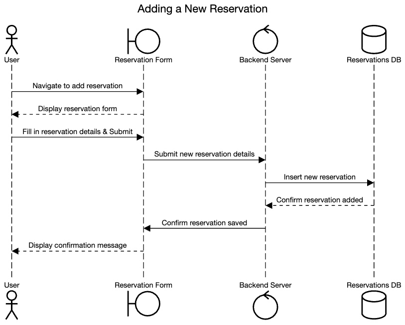
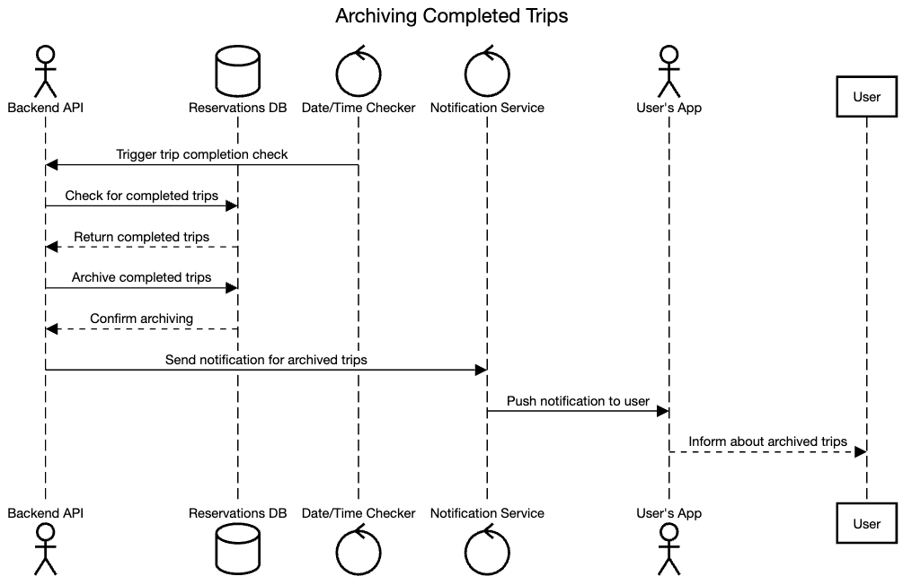

# RoadWarrior Sequence Diagrams

## Introduction

We have envisioned some of the common user journeys in the platform and created sequnce diagrams for the same.

Please note that the user journeys listed here are not exhaustive, and are instead meant to be representative of a broad subset across the most commonly expected user journeys on the platform.

## Contents

- [User Registration and Account Management](#user-registration-and-account-management)
  - [Sign up for an account](#sign-up-for-an-account)
  - [Log into the account](#log-into-the-account)
  - [Edit user profile and preferences](#edit-user-profile-and-preferences)
  - [Log out of the account](#log-out-of-the-account)
- [Email Polling and Travel Email Detection](#email-polling-and-travel-email-detection)
  - [Configure the email for polling](#configure-the-email-for-polling)
  - [Poll the email for travel-related emails](#poll-the-email-for-travel-related-emails)
  - [Notify the user for detected travel emails](#notify-the-user-for-detected-travel-emails)
- [Interfacing with Travel Systems for Updates](#interfacing-with-travel-systems-for-updates)
  - [Fetch updated travel details from Sabre](#fetch-updated-travel-details-eg-delays-cancellations-gate-changes-from-sabre)
  - [Fetch updated travel details from Apollo](#fetch-updated-travel-details-eg-delays-cancellations-gate-changes-from-apollo)
  - [Manually sync the travel details](#manually-sync-the-travel-details-on-user-fetch)
- [Manual Reservation Management](#manual-reservation-management)
  - [Add a new reservation](#add-a-new-reservation)
  - [Update an existing reservation](#update-an-existing-reservation)
  - [Delete a reservation](#delete-a-reservation)
- [Grouping and Archiving Reservations](#grouping-and-archiving-reservations)
  - [Group reservations by trip](#group-reservations-by-trip)
  - [Archive completed trips](#archive-completed-trips)
  - [Manually archive a trip](#manually-archive-a-trip)
- [Social Media and Trip Sharing](#social-media-and-trip-sharing)
  - [Share trip on social media](#share-trip-on-social-media)
  - [Share trip with specific contacts](#share-trip-with-specific-contacts)
  - [Generate a public link for a trip](#generate-a-public-link-for-the-trip)
- [Integration with Travel Agency for Support](#integration-with-travel-agency-for-support)
  - [Report an issue with a reservation](#report-an-issue-with-a-reservation)
  - [Request immediate assistance](#request-immediate-assistance)
  - [Check status of a reported issue](#check-status-of-a-reported-issue)
  - [Provide feedback on support](#provide-feedback-on-support)
- [Analytics and Reporting](#analytics-and-reporting)
  - [Generate end-of-year summary reports](#generate-end-of-year-summary-reports)
  - [Fetch travel trends](#fetch-travel-trends)
  - [View hotel and airline preferences report](#view-hotel-and-airline-preferences-report)
  - [View cancellation and update frequency reports](#view-cancellation-and-update-frequency-reports)

## User Registration and Account Management

### Sign up for an account

_Figure 1: Sign up for an account_

### Log into the account

_Figure 2: Log into the account_

### Edit user profile and preferences

_Figure 3: Edit user profile and preferences_

### Log out of the account

_Figure 4: Log out of the account_

## Email Polling and Travel Email Detection

### Configure the email for polling

_Figure 5: Configuring email for polling_

### Poll the email for travel-related emails

_Figure 6: Poll the email for travel-related emails_

### Notify the user for detected travel emails

_Figure 7: Notify the user for detected travel emails_

## Interfacing with Travel Systems for Updates

### Fetch updated travel details (e.g., delays, cancellations, gate changes) from Sabre

_Figure 8: Fetch updated travel details from Sabre_

### Fetch updated travel details (e.g., delays, cancellations, gate changes) from Apollo

_Figure 9: Fetch updated travel details from Apollo_

### Manually sync the travel details (on user fetch)

_Figure 10: Manually sync the travel details_

## Manual Reservation Management

### Add a new reservation

_Figure 11: Add a new reservation_

### Update an existing reservation

_Figure 12: Update an existing reservation_

### Delete a reservation

_Figure 13: Delete a reservation_

## Grouping and Archiving Reservations

### Group reservations by trip

_Figure 14: Grouping reservations by trip_

### Archive completed trips

_Figure 15: Archive completed trips_

### Manually archive a trip

_Figure 16: Manually archive a trip_

## Social Media and Trip Sharing

### Share trip on social media

_Figure 17: Sharing trip on social media_

### Share trip with specific contacts

_Figure 18: Sharing trip with specific contacts_

### Generate a public link for the trip

_Figure 19: Generating a public link for the trip_

## Integration with Travel Agency for Support

### Report an issue with a reservation

_Figure 20: Reporting an issue with a reservation_

### Request immediate assistance

_Figure 21: Requesting immediate assistance_

### Check status of a reported issue

_Figure 22: Checking status of a reported issue_

### Provide feedback on support

_Figure 23: Providing feedback on support_

## Analytics and Reporting

### Generate end-of-year summary reports

_Figure 24: Generating end-of-year summary reports_

### Fetch travel trends

_Figure 25: Fetching travel trends_

### View hotel and airline preferences report

_Figure 26: Viewing hotel and airline preferences_

### View cancellation and update frequency reports

_Figure 27: Viewing cancellation and update frequency_
