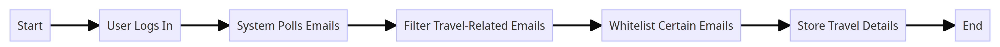
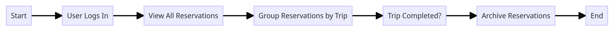

# RoadWarrior User Journeys

## Introduction

We have envisioned some of the common user journeys in the platform in the user journey diagrams below.

Please note that the user journeys listed here are not exhaustive, and are instead meant to be representative of a broad subset across the most commonly expected user journeys on the platform.

## Contents

### Registration and Account Management

_Figure 1: Registration and Account Management_

1. **Start**: The user initiates their journey into the RoadWarrior platform.
2. **Open RoadWarrior Dashboard**: The user accesses the main entry point of the application, the dashboard. Here they're presented with various options, including the ability to sign in or sign up.
3. **Choose Sign Up**: Instead of logging in, the user decides to create a new account. They select the "Sign Up" option.
4. **Enter Personal Details**: A registration form is presented, where the user is prompted to enter their personal details. This could include their name, email address, password, and perhaps other relevant information like contact number or address.
5. **Verify Email**: To ensure the authenticity of the provided email and to prevent fraudulent sign-ups, the user is sent a verification link or code to the email address they provided. They must access their email, retrieve the code or click the link, and enter or confirm it on the RoadWarrior platform to verify their email address.
6. **Set Up Account Preferences**: Once verified, the user is redirected to an account setup page. Here they can customize their account preferences, like setting up their preferred travel modes, linking frequent flier numbers, or choosing notification settings.
7. **End**: Having successfully registered and set up their account preferences, the user's registration journey concludes. They are now a registered member of the RoadWarrior platform and can start using its features fully.

### Email Polling and Travel Email Detection

_Figure 2: Email Polling and Travel Email Detection_

1. **Start**: The journey commences as the user interacts with the RoadWarrior platform.
2. **User Logs In**: The user signs into their RoadWarrior account. This authentication allows the system to access the user's linked email for the polling process.
3. **System Polls Emails**: After successful login, the system automatically begins polling the user's linked email account, searching for new emails.
4. **Filter Travel-Related Emails**: The system filters the fetched emails, identifying those that are potentially travel-related based on specific keywords, patterns, or sender addresses.
5. **Whitelist Certain Emails**: From the identified travel-related emails, the system further filters the list by whitelisting certain trusted senders or email formats, ensuring the information extracted is accurate and reliable.
6. **Store Travel Details**: Once the relevant emails are selected, the system extracts travel details, such as reservation information, dates, flight numbers, etc., and stores them within the user's account for easy access and organization.
7. **End**: The email polling and travel detail extraction process concludes. The user can now view and manage their updated travel details on the RoadWarrior dashboard.

### Interfacing with Travel Systems for Updates

_Figure 3: Interfacing with Travel Systems for Updates_

1. **Start**: The process kicks off when the RoadWarrior platform is actively monitoring for travel updates.
2. **System Detects Travel Change**: Through continuous monitoring, the system detects a potential change or update related to a user's travel plans. This could be through various means such as scanning notifications, API callbacks, or direct communications from integrated travel systems.
3. **Request Details from SABRE/APOLLO**: The system reaches out to the corresponding travel system (e.g., SABRE or APOLLO) to fetch detailed information regarding the detected change.
4. **Receive Real-Time Updates**: The RoadWarrior platform gets real-time updates about the user's travel itinerary, such as flight delays, cancellations, hotel booking modifications, etc., from the travel systems.
5. **Update User's Reservation Details**: Based on the received information, the system promptly updates the user's reservation details in the dashboard to reflect the recent changes.
6. **Send Notification to User**: Once the updates are made, the platform immediately notifies the user about the changes through their preferred communication channel - this could be via the app, SMS, email, or push notifications.
7. **End**: The process of fetching and updating the user's travel information concludes, ensuring the user is always kept in the loop regarding any changes to their itinerary.

### Manual Reservation Management

_Figure 4: Manual Reservation Management_

1. **Start**: The process begins when a user wants to manually manage their reservations on the RoadWarrior platform.
2. **User Logs In**: The user logs into the RoadWarrior dashboard to access their personal travel details.
3. **Open Reservations Section**: After logging in, the user navigates to the reservations section of the dashboard where they can view and manage all their travel reservations.
4. **Choose Add/Update/Delete**: In the reservations section, the user has the option to either add a new reservation, update an existing one, or delete a reservation.
5. **Enter Reservation Details**: Depending on the chosen action (Add/Update), the user is prompted to enter or modify the relevant reservation details, such as flight information, hotel bookings, car rentals, etc.
6. **Save Changes**: Once the necessary details are entered or modified, the user confirms and saves the changes to their reservations.
7. **End**: With the changes saved, the user's manual reservation management process concludes, ensuring their travel plans are accurately reflected on the dashboard.

### Grouping and Archiving Reservations

_Figure 5: Grouping and Archiving Reservations_

1. **Start**: The user decides to organize their reservations on the RoadWarrior platform.
2. **User Logs In**: To initiate the process, the user logs into their RoadWarrior dashboard.
3. **View All Reservations**: After logging in, the user can see a list or grid of all their reservations.
4. **Group Reservations by Trip**: From the displayed reservations, the user has the ability to group multiple reservations together based on a specific trip. This can include grouping flights, hotels, and car rentals for a single trip.
5. **Trip Completed?**: The system checks or prompts the user to verify if the grouped trip has been completed.
6. **Archive Reservations**: If the trip is marked as completed, those reservations associated with the trip are automatically moved to an archive or "past trips" section, decluttering the main dashboard view.
7. **End**: With the reservations appropriately grouped and archived, the user's interaction in this journey concludes.

### Social Media and Trip Sharing

_Figure 6: Social Media and Trip Sharing_

1. **Start**: The user initiates the process to share their trip details on the RoadWarrior platform.
2. **User Logs In**: The user securely logs into their RoadWarrior dashboard.
3. **Select Trip Details**: After successful login, the user navigates to their reservations or trip details they wish to share.
4. **Choose Share Option**: A 'share' or 'broadcast' option is available for the user to initiate the sharing process.
5. **Select Social Media/Specific People**: The user is presented with options to share their trip details on popular social media platforms or directly with specific people through email or messaging.
6. **Confirm Sharing**: Before the details are shared, a confirmation prompt is displayed ensuring that the user is aware of the data they are sharing and to whom it's being shared.
7. **End**: Upon confirmation, the trip details are shared, and the user's interaction in this journey concludes.

### Integration with Travel Agency for Support

_Figure 7: Integration with Travel Agency for Support_

1. **Start**: The journey begins when the user faces any travel-related issue or requires assistance on the RoadWarrior platform.
2. **User Faces Issue**: While using the platform or during their travel, the user encounters a problem or has a query.
3. **Contact Preferred Travel Agency**: The user utilizes the in-app feature to reach out to their preferred travel agency, integrated with the RoadWarrior system, for direct and immediate support.
4. **Agency Provides Support**: The integrated travel agency receives the user's request and provides necessary assistance, be it changes in reservations, clarifications, or other support.
5. **Issue Resolved**: The travel agency successfully addresses the user's issue, and the user is satisfied with the resolution provided.
6. **End**: The user continues to use the platform, and their interaction for this specific support journey concludes.

### Analytics and Reporting

_Figure 8: Analytics and Reporting_

1. **Start**: The user journey begins when the user decides to analyze their travel patterns or requires a summary of their travel data.
2. **User Requests End-of-Year Report**: On the RoadWarrior platform, the user initiates a request for an end-of-year summary, which encompasses details of all their travels, reservations, expenses, and more.
3. **System Gathers User's Travel Data**: In response to the request, the system initiates a process to collect all pertinent travel data associated with the user's account for the specified year.
4. **Generate Comprehensive Report**: Once all data is collected, the system processes and compiles this information to create a detailed and comprehensive report. This report contains metrics, travel patterns, and insights tailored for the user.
5. **Display Report to User**: The generated report is presented to the user through the platform's interface, allowing them to view, analyze, and even download for their records.
6. **End**: Having accessed and reviewed the report, the user's journey in the analytics and reporting segment concludes.